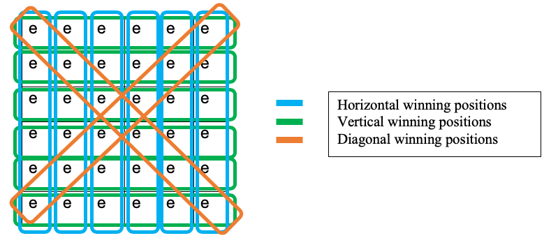
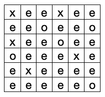

# Project Description
Build a custom (6x6 is used for illustration and explanation purposes) Tic Tac Toe using Reinforcement Learning Techniques

## Challenges
Compared to 3x3 Tic Tac Toe, 6x6 is sparse. It has only 14 winning positions for the players. Winning positions are depicted as follows.

## States:
Represents the state of the board in a string format
A random state of the board as below is represented as xeexeeeeoeeoxeeoeeoeeexeexeeeeeeeeeo where

-	‘e’ means empty
-	‘x’ means RL player
-	‘o’ means opponent

## Actions:
As a normal Tic-Tac-Toe game, board is initialized as all empty ‘eeeeeeeeeeeeeeeeeeeeeeeeeeeeeeeeeeee’ and one of the players start the game. Players play alternately, until either of them win or the both draw. At each slot (representative of time), the player playing in the slot can make a move by placing his/her move in any of the empty slots. 

## Objective:
Minimize the opponent’s win. This objective is chosen because of the high probability of a draws(tie). The right measure of learning will be the ability to reduce the number of times opponent won.

## Solution:

### Framework:

RL agent, Random player, and Judge are present in the framework.

#### Random player
Random player is the opponent to the RL agent. Random Player, as the name suggests plays randomly, by choosing one of the available empty slot as the move.

#### Judge
Judge has the following responsibilities.
-	Decide which player starts the game (Gives chance to each player in alternative games)
- Regulate the game (whose turn when, as per the tic tac toe rules, alternative again)
-	Evaluate the winner (Judge also intelligently declares the draw, even before all the empty slots get exhausted, if it detects there is no possibility of winning by any of the players)
-	Notify both the players about the end of the game and who is the winner
-	Keep the statistics for evaluating the performance

#### Reward Structure:
-	Win: 1
-	Draw: -1
-	Loss: -10
-	Any action leading to none of the above, results in 0 reward

#### Returns and Value functions:
After each episode, RL agent updates the value function using Monte Carlo updates. TD method is unnecessary here, as none of the states get repeated in an episode.

### Algorithm to update the Value Function after an episode:

### Algorithm to choose At at state St:

### Special Techniques used in Learning Efficiently
-	Make use of symmetry of Tic – Tac – Toe board
  One game has 5 alternatives, which corresponds to 
  -	 rotation of the board, 
  -	 degree rotation of the board, 
  -  rotation of the board, 
  -	Diagonal flip of the board, 
  -	Anti-diagonal flip of the board
Refer functions update_values and Transform Dictionary in the code for the details

- Learn from opponent’s moves
On top of self-movements leading to win, loss, draw, we also can learn from opponent’s moves
Refer function update_values in the code for the details

